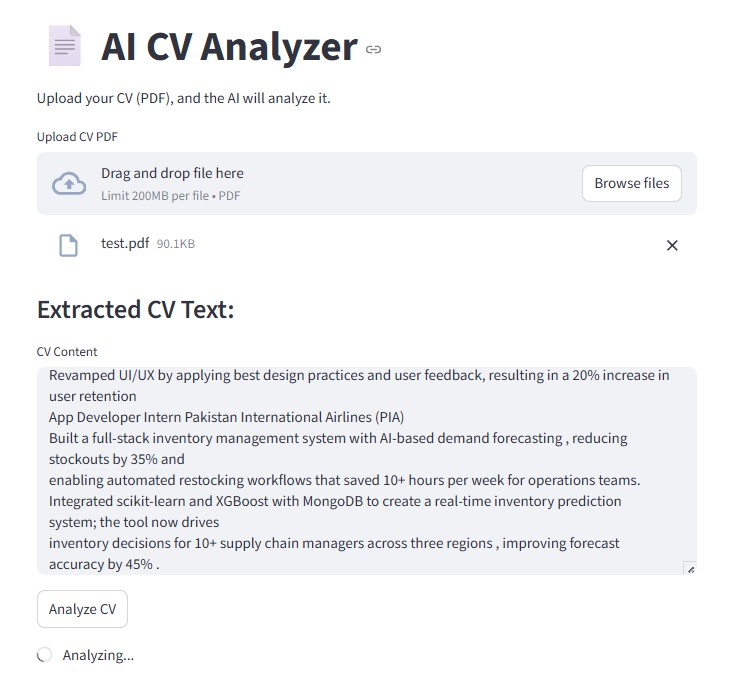
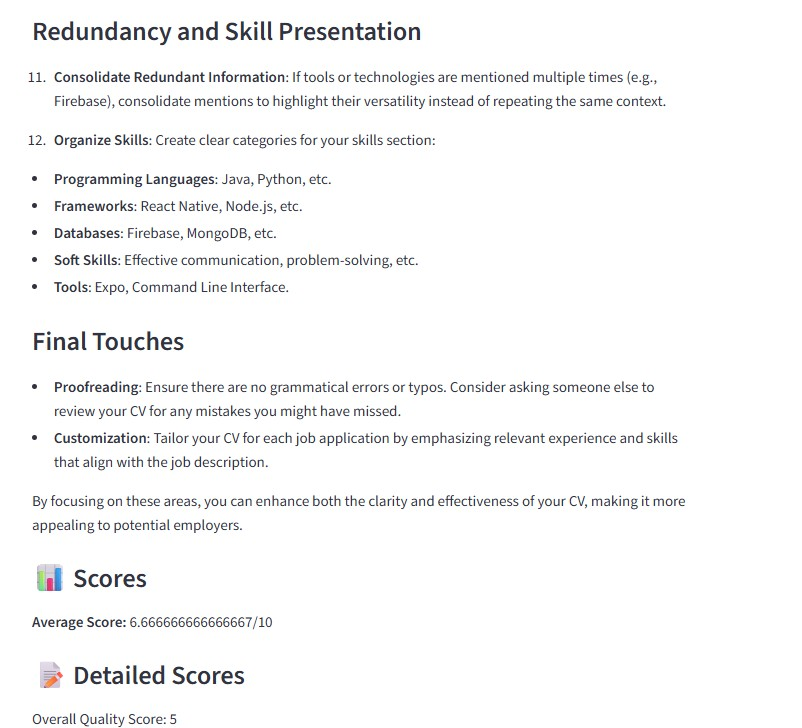
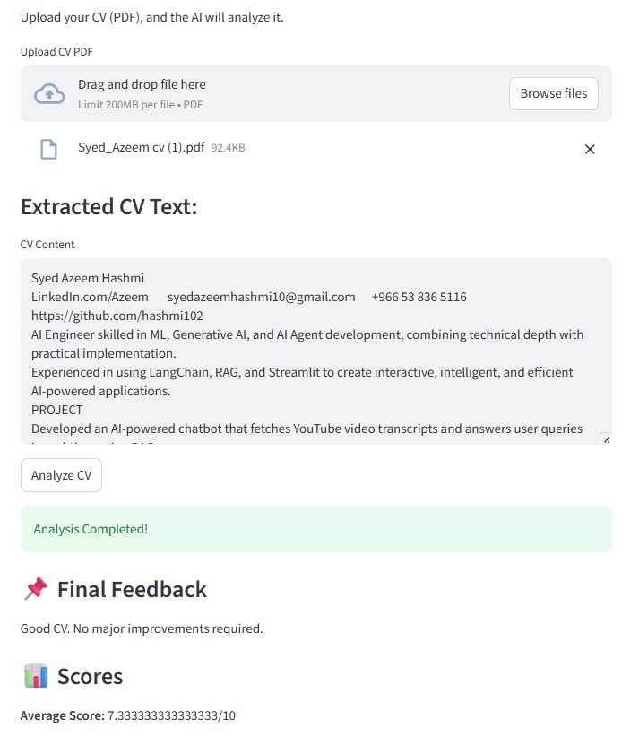

# AI-CV-Analyzer-LangGraph-Streamlit-OpenAI
An intelligent CV/Resume analysis tool built using **LangGraph**, **OpenAI GPT**, and **Streamlit**.  
The app allows users to **upload PDF resumes**, extracts their text, and generates **structured scoring & feedback** such as:

- ⭐ Overall CV Score  
- 🎓 Education Score  
- 💼 Skills Score  
- 📝 Text Extraction Preview  
- 💡 AI-generated suggestions to improve your resume

This is designed as a beginner-friendly project to explore **Generative AI apps**, **graphs/agents**, and **document processing**.

---

## 🚀 Features

- Upload **PDF resumes**
- Extract text using **PyPDF2**
- Process resume content using **LangGraph**
- Generate AI-based scoring (Overall, Education, Skills)
- Display results via a clean **Streamlit UI**
- Works locally and is easy to deploy

---

## 🖥️ Demo Preview

> Upload images in your GitHub repo (inside `/assets` folder or root).  
> Example: `testphoto1.png`

**App UI Example:**  


**PDF Uploaded Example:**  




---

## 🔧 Installation & Setup

### 1. Clone the Repository

```
git clone https://github.com/your-username/AI-CV-Analyzer.git
cd AI-CV-Analyzer
```

### 2. Create Virtual Environment (Recommended)

```
python -m venv myenv
myenv\Scripts\activate      # Windows
```

### 3. Install Requirements

```
pip install -r requirements.txt
```

### 4. Add Your OpenAI API Key

Create a `.env` file:

```
OPENAI_API_KEY=your_api_key_here
```

---

## ▶️ Run the Application

```
streamlit run pdf_score.py
```

The browser will open automatically at:

```
http://localhost:8501
